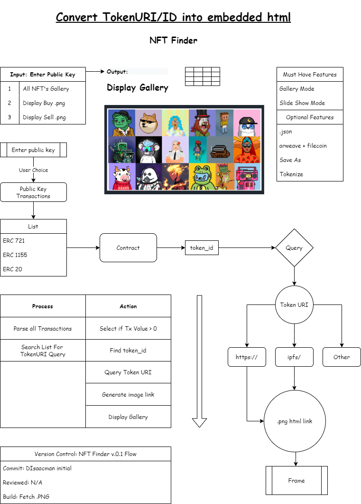

# NFT Finder

## PFP Gallery | Search all NFT's in Address.

 Application that searches all your transactions and displays a NFT gallery/slide show

---
## Map a path to the .png file. 

- Some NFT's link directly to https://
- Below is an ipfs example
- Others have alternative hosting

`Find Contract on Etherscan and query the tokenURI`

## Flow Diagram

### The objective is to find a simple way to link token_id with the query type :

